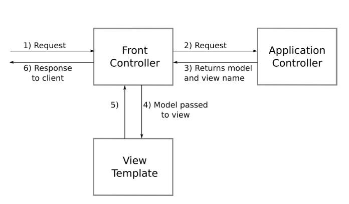
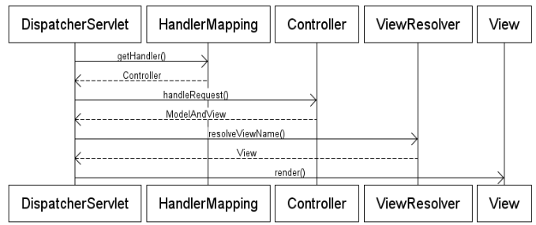

Basics of
Spring MVC
==========

.fx: master

---

MVC
====

* MVC = Model - View - Controller

* Clearly separates business, navigation and presentation logic
* Proven mechanism for building a thin, clean web-tier

---

Controller, Model, View
=======================

* Controller
 - Handles navigation logic and interacts with the service tier for business logic

* Model
 - Contract between Controller and View
 - Contains data needed to render the View
 - Populated by the Controller or the Request

* View
 - Renders the response to the request
 - Pulls data from the Model

---

Spring MVC
==========

* Single Front Controller servlet that dispatches requests to individual Controllers
* Proven pattern shown in Struts and Core J2EE Patterns
* Request routing is completely controlled by the Front Controller
* Individual Controllers can be used to handle many different URLs
* Controllers are POJOs
* Controllers are managed exactly like any other bean in the Spring ApplicationContext

---

Front Controller
================

Spring MVC's Front Controller implementation

---

Model And View
==============

* Created by the Controller
* Holds the Model data
* Associates a View to a Request
* Can be a physical View implementation or a View name

---

Layers inside Spring MVC
========================

---

Handler Mappings
================

* Strategy interface used by Dispatcher Servlet for mapping incoming requests to individual Controllers

* Default implementations available
 - BeanNameUrlHandlerMapping - maps incoming requests to names of beans
 - SimpleUrlHandlerMapping - provides Ant-style path matching capabilities
 
---

View Resolver
=============

* Used to map logical View names to actual View implementations

Supported View Technologies
---------------------------

* JSP
* JSTL
* Velocity
* FreeMarker
* Jasper Reports
* PDF
* Excel
* SiteMesh

---

View Resolver Implementations
=============================

* InternalResourceViewResolver
 - Uses RequestDispatcher to route requests to internal resources such as JSPs
 - Model data is placed in request scope for access in the view

* FreeMarkerViewResolver
 - Uses FreeMarkerView to render the response using the FreeMarker template engine

* VelocityViewResolver
 - Uses VelocityView to render the response using the Velocity template engine

* BeanNameViewResolver
 - Maps the view name to the name of a bean in the ApplicationContext.
 - Allows for view instances to be explicitly configured

---

Controller Example
==================

	!java
	public class BeerListController implements Controller {
	
	    @Autowired
	    private CheerService cheerService;
	
	    private void setCheerService(CheerService service) {
	        this.cheerService = service;
	    }
	
	    public ModelAndView handleRequest(HttpServletRequest request, HttpServletResponse response) throws Exception {
	
	        List<Beers> beers = this.cheerService.findAllBeers();
	
	        ModelAndView mav = new ModelAndView();
	        mav.addObject("beers", beers);
	        mav.setViewName("showBeerList");
	    }
	}

---

View with JSP and JSTL
======================

	!jsp
	<%@ page contentType="text/html;charset=UTF-8" language="java" %>
	<%@ taglib uri="http://java.sun.com/jsp/jstl/core" prefix="c" %>
	<%@ taglib uri="http://java.sun.com/jsp/jstl/fmt" prefix="fmt" %>
	
	<html>
		<head><title>Beer List</title></head>
		<body>
			<table border="0">
				<c:forEach items="${beers}" var="beer">
					<tr>
						<td><c:out value="${beer.id}"/></td>
						<td><c:out value="${beer.brand}"/></td>
					</tr>
				</c:forEach>
			</table>
		</body>
	</html>

---

Configuring a Spring MVC Application
====================================

* Configure the DispatcherServlet in web.xml
* Configure ContextLoaderListener or ContextLoaderServlet to load the business tier and data tier ApplicationContexts
* Create the web-tier ApplicationContext configuration file
* Configure Controllers
* Map URLs to Controllers
* Map logical view names to view implementations

---

web.xml
=======

	!xml
	<web-app>
	
		<!-- Load Spring applicationContext.xml -->
		<listener>
			<listener-class>org.springframework.web.context.ContextLoaderListener</listener-class>
		</listener>
		
		<servlet>
			<description>Handles all UI request calls</description>
			<display-name>UserInterface</display-name>
			<servlet-name>ui</servlet-name>
			<servlet-class>org.springframework.web.servlet.DispatcherServlet</servlet-class>
		</servlet>
		
		<servlet-mapping>
			<servlet-name>ui</servlet-name>
			<url-pattern>*.html</url-pattern>
		</servlet-mapping>
		
	</web-app>
		
---

Creating Application Context
============================

	!xml
    <bean id="dataSource" class="org.springframework.jdbc.datasource.DriverManagerDataSource">
		<property name="driverClassName" value="com.mysql.jdbc.Driver" />
		<property name="url" value="jdbc:mysql://localhost:3306/mydatabase" />
		<property name="username" value="root" />
		<property name="password" value="root" />
	</bean>
	
---

Define Controllers
==================

	!xml
	<bean name="developerController" class="com.adobe.chc.developer.web.DeveloperController" >
		<property name="methodNameResolver" ref="parameterMethodNameResolverWithDefaultMethod" />
	</bean>
	
	<bean name="bookmarksController" class="com.adobe.chc.boomarks.web.ProductBookmarksController" >
		<property name="methodNameResolver" ref="parameterMethodNameResolverWithDefaultMethod" />
	</bean>
	
	<bean name="showIconController" class="com.adobe.chc.icon.web.ShowIconController">
	</bean>
	
	<bean name="authenticationController" class="com.adobe.chc.security.web.AuthenticationController" >
		<property name="methodNameResolver" ref="parameterMethodNameResolverWithDefaultMethod" />
	</bean>
	
---

Map URLs to Controllers
=======================

* BeanNameUrlHandlerMapping
Uses the Controller bean name as the URL mapping

* SimpleUrlHandlerMapping
Define a set of URL pattern to bean mappings

* Most out of the box implementations support Ant-style path matching

---

Create a View Resolver
======================

	!xml
	<bean id="viewResolver" class="org.springframework.web.servlet.view.UrlBasedViewResolver" >
		<property name="viewClass">
			<value>org.springframework.web.servlet.view.tiles2.TilesView</value>
		</property>
	</bean>
	
	<bean id="tilesConfigurer" class="org.springframework.web.servlet.view.tiles2.TilesConfigurer" >
		<property name="definitions" >
			<list>
				<value>/WEB-INF/tiles/tiles-defs.xml</value>
			</list>
		</property>
	</bean>
	
---

Configure Handler Mappings
==========================

	!xml
	<bean name="urlMapping" class="org.springframework.web.servlet.handler.SimpleUrlHandlerMapping">
		<property name="mappings">
			<props>
				<prop key="/index.html">forwardController</prop>

				<prop key="/admin/login.html">authenticationController</prop>
				<prop key="/admin/logout.html">authenticationController</prop>
				
				<prop key="/admin/index.html">serverStatusController</prop>

				<prop key="/admin/productCache.html">productCacheController</prop>
				<prop key="/admin/products.html">productController</prop>

				<prop key="/admin/icons.html">productIconController</prop>
				<prop key="/admin/icon.html">showIconController</prop>
			</props>
		</property>
	</bean>

---

Available Controllers
=====================

* Controller
 - public ModelAndView handleRequest(HttpServletRequest request, HttpServletResponse response)
* AbstractController
 - public ModelAndView handleRequestInternal(HttpServletRequest request, HttpServletResponse response)
* ParameterizableViewController
 - same as AbstractController, move View name to config file than Java
* UrlFilenameViewController
 - inspects the URL and retrieves the filename of the file request and uses that as a viewname
* MultiActionController
 - handle multiple end points via single controller
 
---

Command Controllers
===================

Provide a way to interact with data objects and dynamically bind parameters from the HttpServletRequest to the data object specified

* AbstractCommandController

* AbstractFormController

* SimpleFormController

* AbstractWizardController

---

Multi Action Controller
=======================

* One controller to handle different tasks
* Multiple handler methods
* Each method handles a different request
* MethodNameResolver determines method Based on parameter or other criteria
* Can use a delegate to come up with ModelAndView
* Good for grouping related tasks into a single class

---

MultiActionController Example
=============================

	!java
	public class SpringCheersController extends MultiActionController {

		private SpringCheersService service;

		/** setter ommitted */

		public ModelAndView handleCustomerList(HttpServletRequest request, HttpServletResponse response) {
			return new ModelAndView("customerList",	"customers", this.service.getCustomerList());
		}
		
		public ModelAndView handleViewCustomer(HttpServletRequest request, HttpServletResponse response) throws Exception {
			long id = RequestUtils.getRequiredLongParameter(request, "customerId");
			return new ModelAndView("viewCustomer", "customer", this.service.getCustomer(id));
		}
	}

---

Signatures in MultiActionController
===================================

	!java
	public (ModelAndView | Map | String | void) actionName(HttpServletRequest request, HttpServletResponse response);
	
	public (ModelAndView | Map | String | void) actionName(HttpServletRequest request, HttpServletResponse response, HttpSession session);
	
	public (ModelAndView | Map | String | void) actionName(HttpServletRequest request, HttpServletResponse response, Object command);

---

Signatures in MultiActionController
===================================

* ModelAndView - Standard return value
* Map - Considered as Model, View chosen using RequestToViewNameTranslator
* String - Considered as the View name
* void - Don't continue the chain - response has already been handled

* HttpSession - Existing session is required
* Object - Considered as the command object and pre-populated with values from request parameters
 
* Note that all handler methods need to be public and that method overloading is not allowed.

---

Handling Form Data
==================

	!java
	public class Contact {
	
		private String firstName;
		
		private String lastName;
		
		private String email;
		
		private String phone;
		
		// getter/setter's omitted for brevity
	}

---

Create the View
===============

	!jsp
	<form action="/submitContact.do" method="POST">
		<label>First Name</label>
		<input type="text" id="firstName" />
		
		<label>Last Name</label>
		<input type="text" id="lastName" />
		
		<label>Email</label>
		<input type="text" id="email" />
		
		<label>Phone</label>
		<input type="text" id="phone" />
	</form>

---

Reading Values in Controller
============================

	!java
	public class MyController extends MultiActionController {
	
		public String submitForm(HttpServletRequest request, HttpServletResponse response, Contact contact) {
			// we have the request parameters mapped to command object
			
			System.out.println(contact.getFirstName());
			
			this.contactService.submit(contact);
			
			return "formSubmitComplete";
		}
	}

---

Reading List in Controller
==========================

	!java
	public class ContactForm {
	
		private List<Contact> contacts;
		
		public List<Contact> getContacts() {
			return this.contacts;
		}
		
		public void setContacts(List<Contact> contacts) {
			this.contacts = contacts;
		}
	}

---

Modifying the View
==================

	!jsp
	<form action="/submitContacts.do" method="POST">
		<table>
			<tr>
				<th>First Name</th>
				<th>Last Name</th>
				<th>Email</th>
				<th>Phone</th>
			</tr>
			<c:forEach items="${form.contacts}" var="contact" varStatus="status">
				<tr>
					<td>${status.count}</td>
					<td>
						<input name="contacts[${status.index}].firstName" value="${contact.firstName}" />
					</td>
				</tr>
			</c:forEach>
		</table>
	</form>

---

Modifying the Controller
========================

	!java
	public ModelAndView save(HttpServletRequest request, HttpServletResponse response, ContactForm form) {
		List<Contact> contacts = form.getContacts();
		
		// go ahead and do whatever we want to
	}

---

Request flow in Form Controllers
================================

* GET request displays the form
* POST request submits the form
* Both have distinctive workflow
 - GET does not need validation
 - POST does not need the form view

---

Command Controllers Revisited
=============================

Provide a way to interact with data objects and dynamically bind parameters from the HttpServletRequest to the data object specified

* AbstractCommandController
 - capable of binding params to data object
 - does not offer form functionality
 - offers validation support

* AbstractFormController
 - offers form submission support
 - binds fields, validates form, and hands back object to Controller
 - supports invalid form submission

---

Command Controllers Revisited
=============================

* SimpleFormController
 - Extends AbstractFormController
 - specify command object, viewname of the form, viewname for success etc.
 
* AbstractWizardController
 - Helps build wizards with multiple steps in complete form submission
 - implement validatePage(), processFinish(), processCancel()
 
---

Handling Form POST
==================

* Create the custom SimpleFormController
* Create the form view
* Adding data binding logic to the form view
* Add error display logic to the form view
* Create the success view
* Define a command object for the form
* Add on submit logic

Optionally,
-----------

* Add validation logic
* Hook in custom data binding logic

---

The Controller
==============

	!java
	public class UserController extends SimpleFormController {
	
		public UserController() {
			setCommandClass(User.class);
			setCommandName("user");
		}
		
		protected ModelAndView onSubmit(Object command) throws Exception {
			User user = (User) command;
			
			this.userService.addUser(user);
			
			return new ModelAndView("userSuccess", "user", user);
		}
	}
	
---

The Form
========

	!jsp
	<form:form method="POST" commandName="user">
		User Name
		<form:input path="name" />
		
		Password
		<form:password path="password" />
		
		Gender
		<form:radiobutton path="gender" value="M" label="Male" />
		<form:radiobutton path="gender" value="F" label="Female" />
		
		Country
		<form:select path="country">
			<form:option value="0" label="Select" />
			<form:option value="1" label="India" />
			<form:option value="2" label="USA" />
			<form:option value="3" label="UK" />
		</form:select>
		
	</form:form>

---

Wiring
======

	!xml
	<bean id="userService" class="example.UserServiceImpl" />
	
	<bean name="/userRegisterationForm.html" class="example.UserController">
		<property name="userService" ref="userService" />
		<property name="formView" value="userForm" />
		<property name="successView" value="userSuccess" />
	</bean>

---

GET Request - Form Display
==========================

* formBackingObject()
 - Retrieve the command object
 - Allows pre-population of form
* initBinder()
 - Register custom editors
* referenceData()
 - Load reference data needed for displaying the form
* showForm()
 - Completed ModelAndView and returns
 - Command object stored in session, if configured
 - Renders the actual form

---

POST Request - Form Submission
==============================

* formBackingObject()
 - Retrieve the command object
 - from session, or may be, database
* initBinder()
 - Register custom editors
 - Binding of request parameters to form
* onBind()
 - Called after bind but *before* validation
 - Allows for manually binding request parameters
* onBindAndValidate()
 - Allows to bind parameters that don't need validation

* If validation fails, add errors to ModelAndView and show form
* if succeeds, call onSubmit() and show the success view

---

Questions?
==========

---

References
==========

* [http://static.springsource.org/spring/docs/2.5.x/reference/mvc.html](http://static.springsource.org/spring/docs/2.5.x/reference/mvc.html)
* [http://springdeveloper.com/oscon/mvc.pdf](http://springdeveloper.com/oscon/mvc.pdf)
* [http://www.slideshare.net/Intertech/spring-mvc-training](http://www.slideshare.net/Intertech/spring-mvc-training)
* [http://www.slideshare.net/rapaul/introduction-to-spring-mvc](http://www.slideshare.net/rapaul/introduction-to-spring-mvc)
* [http://www.vaannila.com/spring/spring-simple-form-controller-1.html](http://www.vaannila.com/spring/spring-simple-form-controller-1.html)

---

Thanks!
=======
